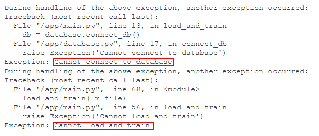

1. cd into this temp-app folder
2. docker compose up -d
3. **Wait for around 20 mins if composing for the first time**
- **Note**: It is normal to see 'error' messages relating to connecting to the database and loading and training the models initially. An example is shown in the image below. This is because for the first 5-10 mins, the MySQL database is still being initialised. 

4. Open rshiny app on localhost:8567